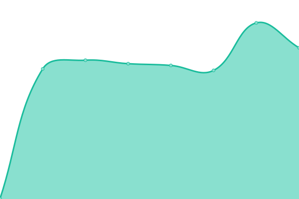
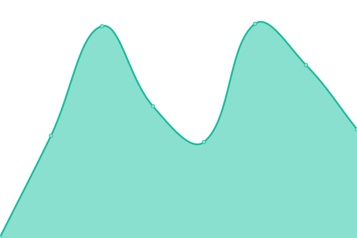
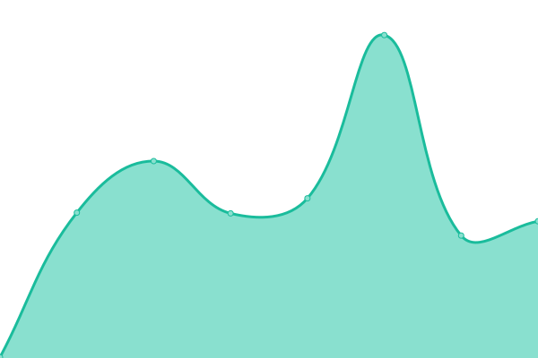

# [NoMercy Status](https://status.nomercy.tv)

This repository contains the status page for [NoMercy Entertainment](https://nomercy.tv), powered by [Upptime](https://github.com/upptime/upptime).

<!--start: status pages-->
<!-- This summary is generated by Upptime (https://github.com/upptime/upptime) -->
<!-- Do not edit this manually, your changes will be overwritten -->
<!-- prettier-ignore -->
| URL | Status | History | Response Time | Uptime |
| --- | ------ | ------- | ------------- | ------ |
|  [Website](https://nomercy.tv) | 🟥 Down | [website.yml](https://github.com/NoMercy-Entertainment/nomercy-status/commits/HEAD/history/website.yml) | 

 574ms
     
 | 

<a href="https://status.nomercy.tv/history/website">100.00%</a>
    

|  [API](https://api.nomercy.tv) | 🟥 Down | [api.yml](https://github.com/NoMercy-Entertainment/nomercy-status/commits/HEAD/history/api.yml) | 

 533ms
     
 | 

<a href="https://status.nomercy.tv/history/api">100.00%</a>
    

|  [CDN](https://cdn.nomercy.tv) | 🟥 Down | [cdn.yml](https://github.com/NoMercy-Entertainment/nomercy-status/commits/HEAD/history/cdn.yml) | 

 198ms
     
 | 

<a href="https://status.nomercy.tv/history/cdn">100.00%</a>
    

|  [Authentication](https://auth.nomercy.tv) | 🟥 Down | [authentication.yml](https://github.com/NoMercy-Entertainment/nomercy-status/commits/HEAD/history/authentication.yml) | 

 206ms
     
 | 

<a href="https://status.nomercy.tv/history/authentication">100.00%</a>
    

<!--end: status pages-->

[**Visit the status page &rarr;**](https://status.nomercy.tv)
