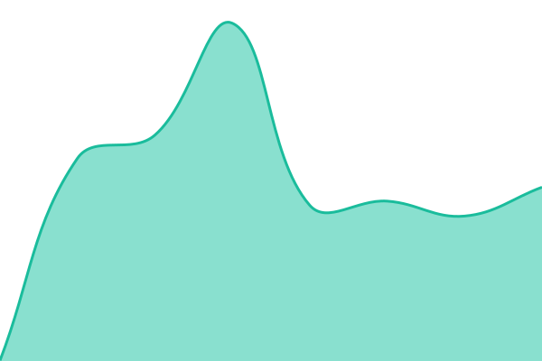
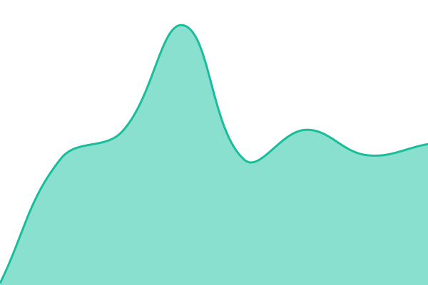
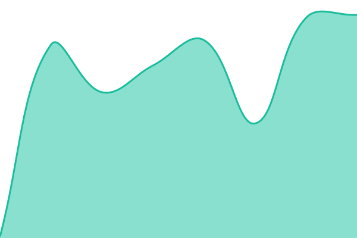
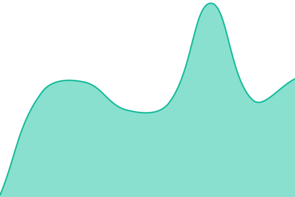
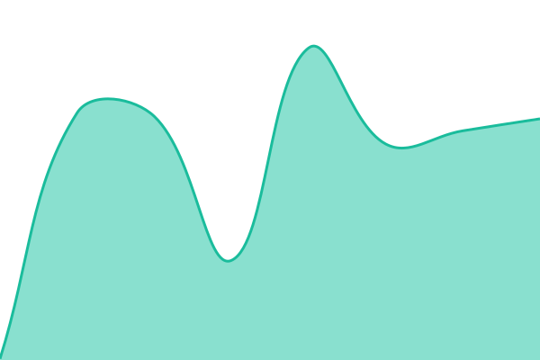

# [NoMercy Status](https://status.nomercy.tv)

This repository contains the status page for [NoMercy Entertainment](https://nomercy.tv), powered by [Upptime](https://github.com/upptime/upptime).

Monitored today (see `.upptimerc.yml`): the website, the control plane API, the web
app, Keycloak auth, the CDN, the docs site and the package repository — seven checks,
run every five minutes.

Each check targets something only that service can serve. This matters: nomercy.tv,
api.nomercy.tv and cdn.nomercy.tv all sit behind the same Cloudflare front door, and a
bare `GET` on the apex of each returns the byte-identical page. Probing those apexes
would give three green rows that all measure the same thing, so the API is checked via
a real authenticated route, the CDN via a real asset, and auth via Keycloak's realm
document. Response-time ceilings are set per service, so a service that is reachable
but slow reports as degraded rather than up.

The media server is self-hosted by each user, so there is no instance for this page to
monitor and it is deliberately absent.

The status table below is generated by Upptime; do not edit it by hand, it is
overwritten on every run.

<!--start: status pages-->
<!-- This summary is generated by Upptime (https://github.com/upptime/upptime) -->
<!-- Do not edit this manually, your changes will be overwritten -->
<!-- prettier-ignore -->
| URL | Status | History | Response Time | Uptime |
| --- | ------ | ------- | ------------- | ------ |
|  [Website](https://nomercy.tv) | 🟥 Down | [website.yml](https://github.com/NoMercy-Entertainment/nomercy-status/commits/HEAD/history/website.yml) | 

 0ms
     
 | 

<a href="https://status.nomercy.tv/history/website">100.00%</a>
    

|  [API](https://api.nomercy.tv/v1/server) | 🟥 Down | [api.yml](https://github.com/NoMercy-Entertainment/nomercy-status/commits/HEAD/history/api.yml) | 

 0ms
     
 | 

<a href="https://status.nomercy.tv/history/api">100.00%</a>
    

|  [App](https://app.nomercy.tv) | 🟩 Up | [app.yml](https://github.com/NoMercy-Entertainment/nomercy-status/commits/HEAD/history/app.yml) | 

 99ms
     
 | 

<a href="https://status.nomercy.tv/history/app">100.00%</a>
    

|  [Authentication](https://auth.nomercy.tv/realms/master) | 🟥 Down | [authentication.yml](https://github.com/NoMercy-Entertainment/nomercy-status/commits/HEAD/history/authentication.yml) | 

 0ms
     
 | 

<a href="https://status.nomercy.tv/history/authentication">100.00%</a>
    

|  [CDN](https://cdn.nomercy.tv/logo.png) | 🟥 Down | [cdn.yml](https://github.com/NoMercy-Entertainment/nomercy-status/commits/HEAD/history/cdn.yml) | 

 0ms
     
 | 

<a href="https://status.nomercy.tv/history/cdn">100.00%</a>
    

|  [Docs](https://docs.nomercy.tv) | 🟩 Up | [docs.yml](https://github.com/NoMercy-Entertainment/nomercy-status/commits/HEAD/history/docs.yml) | 

 211ms
     
 | 

<a href="https://status.nomercy.tv/history/docs">100.00%</a>
    

|  [Packages](https://repo.nomercy.tv) | 🟩 Up | [packages.yml](https://github.com/NoMercy-Entertainment/nomercy-status/commits/HEAD/history/packages.yml) | 

 218ms
     
 | 

<a href="https://status.nomercy.tv/history/packages">100.00%</a>
    

<!--end: status pages-->

[**Visit the status page &rarr;**](https://status.nomercy.tv)
